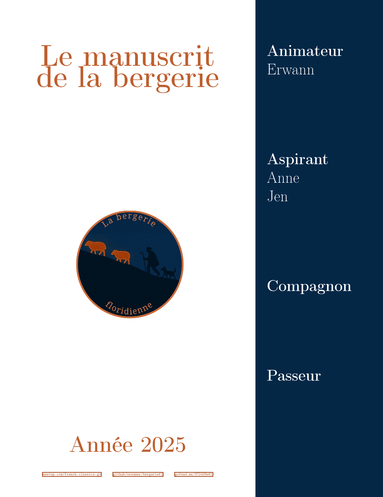
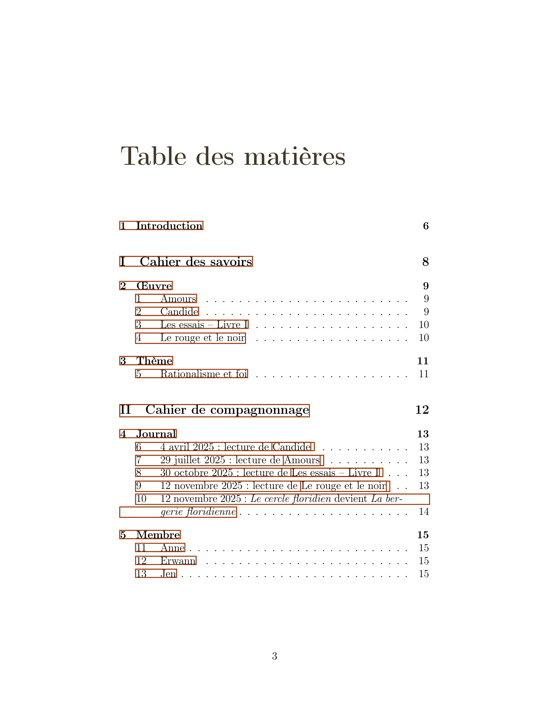
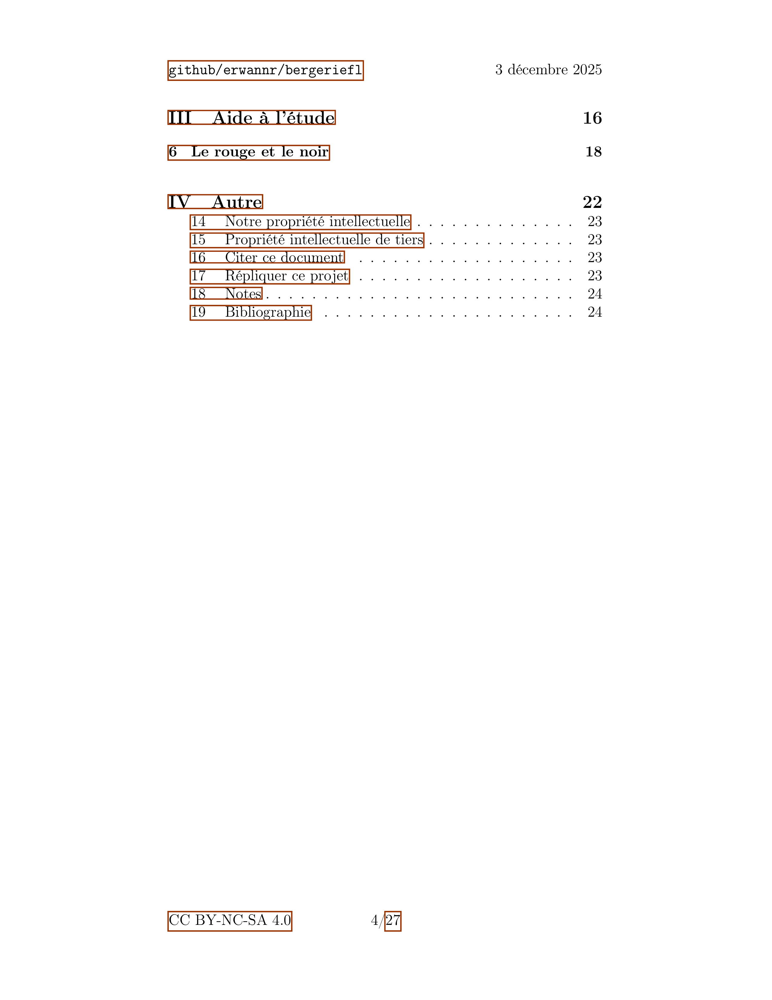
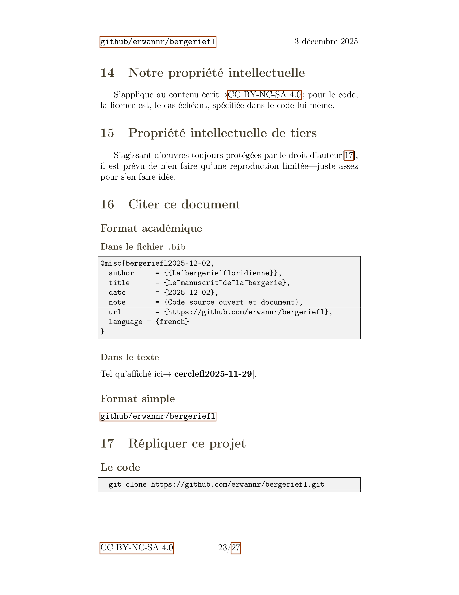

# Le manuscrit de la bergerie

## Purpose
### Français
*La bergerie de Floride* est un groupe de lecture francophone de Floride fondé sur la philosophie des « bergers érudits », que « c'est l'assimilation qui compte ». Ce dépôt en constitue le registre avec pour produit final un [pdf](./pdf/assemble.pdf).

### English
*La bergerie de Floride* is a French-speaking reading group in Florida founded on the philosophy of the "scholarly shepherds", that "it's assimilation that counts". This [document](./pdf/assemble.pdf) serves as its record.

## Links
[Support me](https://gofund.me/372439e61)

[Meetup](https://www.meetup.com/french-classics-gv)

## Troubleshooting
Sometimes [pdf don't render on github](https://github.com/orgs/community/discussions/64419); in that case, disable any widget that might be the culprit, clear the browser's cache, and as a last resort, download it.

## Preview

